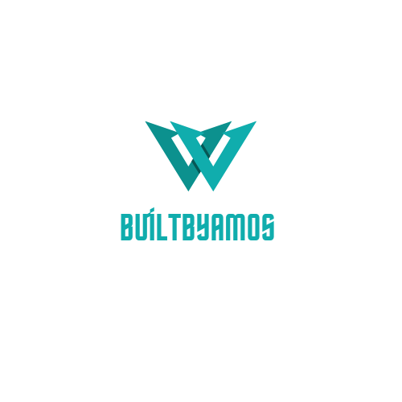

<h1 align="center">🚀 BuiltByAmos</h1>
<h3 align="center">Crafting Digital Products with Code, Design & AI</h3>

  

  <b>Turn ideas into high-quality websites, mobile apps, and intelligent AI/ML systems.</b> 
  BuiltByAmos blends <b>engineering, design, and research</b> to deliver scalable, production-ready digital products.

---

## 🌟 About Us

**BuiltByAmos** is a digital engineering studio founded by **Amos Anand**, headquartered in **Garhwa, Jharkhand, India**.  
We craft world-class digital products — from concept to code — helping startups and businesses build meaningful software.

---

## 🚀 What We Do

We specialize in **end-to-end product development** across 3 major domains:

### 💻 Web Development
Modern, responsive websites and web apps — landing pages, e-commerce, SaaS platforms, PWAs, and more.

### 📱 Mobile App Development
Native and cross-platform apps (iOS, Android) built with robust architecture, smooth UX, and reliable performance.

### 🧠 AI / ML / Deep Learning
Data pipelines, model training, MLOps, computer vision, NLP, recommendation systems, and custom deep learning models.

---

## 🧩 Services & Offerings

✅ Product discovery, requirement analysis & technical strategy  
✅ UX/UI design & interaction design  
✅ Frontend engineering (React, Vue, Svelte, modern JS)  
✅ Backend & APIs (Node.js, Python, Django, FastAPI)  
✅ Mobile (Flutter, React Native, native iOS/Android)  
✅ Cloud & DevOps (AWS, GCP, Docker, Kubernetes, CI/CD)  
✅ Data engineering & ML Ops (data pipelines, model deployment, monitoring)  
✅ Model development (TensorFlow, PyTorch, scikit-learn)  
✅ Post-launch maintenance, analytics & growth engineering  

---

## 💡 Why Choose Us

✨ **End-to-End Delivery** — from idea to deployment & monitoring  
🧩 **Cross-Disciplinary Expertise** — design, frontend, backend & ML under one roof  
⚙️ **Scalable Architecture** — clean code and long-term maintainability  
📈 **Business Focused** — measurable outcomes and real business impact  
💬 **Agile Communication** — transparent, iterative, and efficient  

---

## 🛠️ Technologies We Love

> **Languages & Frameworks:**  
> React • Next.js • Node.js • TypeScript • Python • Django • FastAPI • Flutter • React Native  

> **AI/ML Tools:**  
> TensorFlow • PyTorch • scikit-learn  

> **Databases & Cloud:**  
> PostgreSQL • MongoDB • Redis • Docker • Kubernetes • AWS • GCP  

---

## ⚙️ Our Process

| Phase | Description |
|-------|--------------|
| 🔍 Discovery | Understand goals, users & constraints |
| 🎨 Design | Wireframes, prototypes & UX review |
| 🧱 Build | Iterative sprints & continuous feedback |
| 🚀 Launch | Testing, deployment & performance optimization |
| 📊 Improve | Analytics, A/B testing & scaling |

---

## 📂 Portfolio / Case Studies

| Project | Description | Highlights |
|----------|--------------|-------------|
| **Project A** | E-commerce web app | Conversion uplift, scalable payments |
| **Project B** | Cross-platform mobile app | 4.8 rating, real-time data sync |
| **Project C** | AI-based automation system | 92% accuracy, deployed on cloud |

> _Want to see more?_ → [Visit Portfolio →](https://builtbyamos.com)

---

## 🤝 Get In Touch

📍 **Address:** Garhwa, Jharkhand, India  
🌐 **Website:** [https://builtbyamos.com](https://builtbyamos.com)  
📧 **Email:** [hello@builtbyamos.com](mailto:builtbyamos@gmail.com)  
💻 **GitHub:** [github.com/builtbyamos](https://github.com/builtbyamos)  
🔗 **LinkedIn:** [linkedin.com/company/builtbyamos](https://www.linkedin.com/company/builtbyamos)

---

## 💬 Contribute / Feedback

This repository represents our studio portfolio.  
💡 If you'd like to improve this README, suggest new portfolio entries, or collaborate —  
open an **issue** or submit a **pull request**. Contributions are welcome!

---

## 📝 License

Specify your preferred license here (e.g., **MIT License**).  
© 2025 **BuiltByAmos** — We build products people love and systems that scale 🚀

---

  
  

